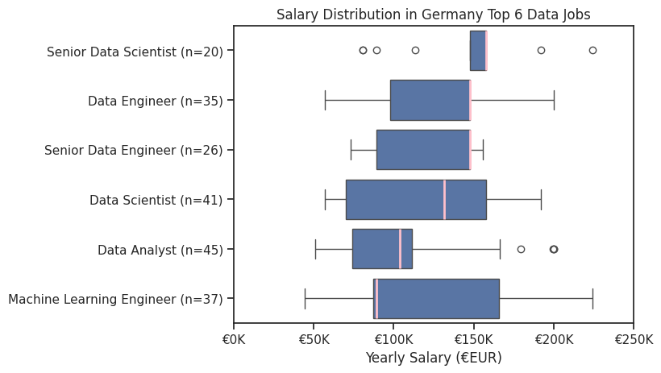
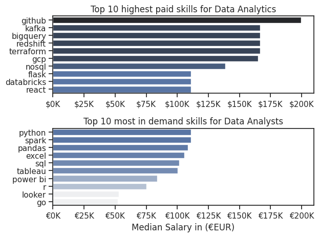
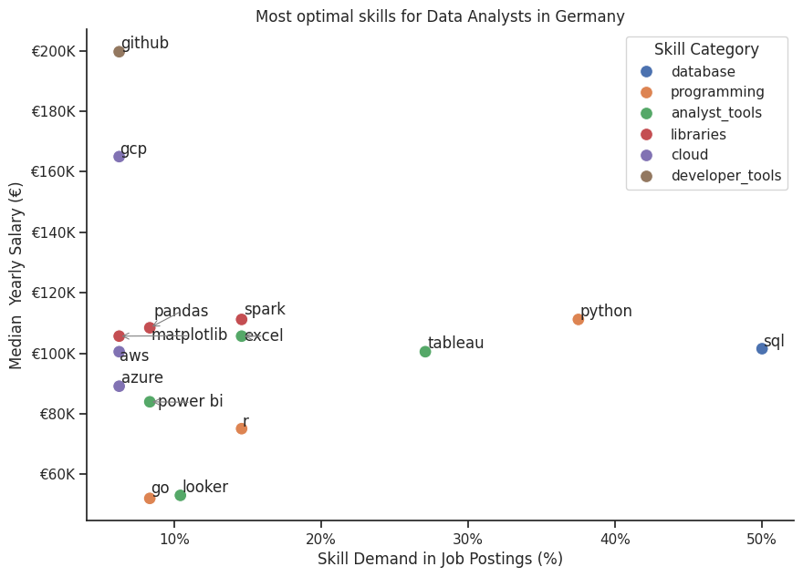

# Project Overview
This project provides an analysis of the data job market in Germany. It investigates the top-paying and in-demand skills for leading data roles, with a more in-depth focus on Data Analyst roles.  
This project was developed as part of Luke Barousse’s Python for Data Analytics course, using the provided dataset as the foundation for independent analysis.
One limitation of this analysis is that the German dataset has a relatively small sample size compared to the US dataset used in the course material, which may affect the stability and generalisability of the results.

## Initial Questions
1. What are the most in-demand skills for the 3 most popular data roles?
2. How are in-demand skills for Data Analysts trending?
3. How well do jobs and skills pay for Data Analysts?
4. Which skills are most valuable to learn (based on demand and salary impact) ?

## Tools used
**Key Tools**
- Python & Jupyter Notebooks (within Visual Studio Code)
    - **Pandas** used to analyze data
    - **Matplotlib** used to visualize data
    - **Seaborn** used to adjust and improve visualizations 
  
## Data Prep & Cleanup
View notebook for details: [Notebook0: EDA_Intro](0_EDA_Intro.ipynb)  

## Analysis
Each jupyter notebook for this project investigates specific aspects of the data job market:
### 1. What are the most demanded skills for the top 3 data roles?
View notebook for details: [Notebook1: Skills_Count](1_Skills_Count.ipynb)  
**Data Visualization**  
  
Bar graph visualizing top in-demand 5 skills associated with each role  
**Insights:**
- Python & SQL are the most in-demand skills for all Data Scientists, -Analysts & Engineers, with Python leading in DS & DE roles, SQL leading in DA roles
- Data Engineers and Scientists require more specialized technical skills like AWS &Azure whereas Data Analyst skills focus on more general data management and analysis tools like tableau & excel    

### 2. How are in-demand skills trending for Data Analysts?
View notebook for details: [Notebook2: Skills_Trend](1_Skills_Trend.ipynb)  
**Data Visualization**  
  
Line chart visualizing top in-demand 5 skills for Data Analysts trending over the year 2023  
**Insights:**
- SQL and Python remain most demanded skills throughout the year, tho SQL is showing a downward trend
- There is a visible downward trend for almost all skills starting after July/August suggesting a seasonal low in hiring or shift in job descriptions. It shows a slight recovery by the end of the year
- all top skills are still relevant and dont show significant decline

### 3. How well do jobs and skills pay for Data Analysts?
View notebook for details: [Notebook3: Salary_Analysis](3_Salary_Analysis.ipynb)  
**Data Visualization 1: General overview**  
  
Box Plot visualizing Salary of Top 6 Data Roles in Germany  
**Insights:**
- Salary distributions are based on a relatively small sample size per role (n ≈ 20–50), which leads to higher variability. Results should be interpreted as indicative rather than definitive.
- Senior roles are not cleanly separated, most likely due to small sample size (~25), e.g. Data Engineer median slightly higher than Senior Data Engineer
- For most roles, the median appears closer to the upper quartile, suggesting a concentration of salaries in the higher range of the distribution, with fewer lower-paying observations. This pattern may reflect selection bias, as salary information is more commonly reported for higher-paying roles in Germany.
- For Machine Learning Engineers median appears closer to lower quartile which shows higher variety in MLE jobs  
**Data Visualization 2: Highest paying and most indemand skills for Data Analysts**  
  
Bar Chart comparing most in demand and highest paying skills for Data Analysts  
**Insights:**
- Cloud & Data Engineering skills dominate pay. They likely represent a small niche of hybrid "Data Engineer/Analyst" roles rather than classic analyst positions. These outlier salaries can be misleading benchmarks for pure analyst positions.
- Still there's a clear pay gap between "in-demand" and "high-paying" skills.
The chart suggests to upskill into cloud tools on top of analyst fundamentals for breaking into the upper salary tier.
- Coding skills outpace traditional analyst tools in pay (Python, Spark, and Pandas). SQL, Excel and Tableau remain essential for getting hired but offer lower pay ceilings.

### 4. Which skills are most valuable to learn for Data Analysis?  
View notebook for details: [Notebook4: Optimal Skills](4_Optimal_Skills.ipynb)  
**Data Visualization**  
  
Scatter Plot showing the relation between skills and pay for Data Analysts  
**Insights:**
- The plot shows that cloud and developer tools on top of standard analyst tools are associated with higher salaries. Though results likely reflect a smaller subest of hybrid technical roles.
- Database and programming tools show higher market demand than standard analyst tools.

## Conclusion
Overall, the analysis shows that SQL and Python are the core skills across all major data roles in Germany, while analyst roles rely more heavily on BI tools such as Excel and Tableau. Higher salaries are more strongly associated with technical and cloud-based skills, suggesting a clear pay gap between foundational analyst tools and more advanced engineering-oriented skills. While demand for key skills remains relatively stable over time, salary outcomes vary significantly across roles. Due to the relatively small German dataset, these findings should be interpreted as indicative rather than definitive.