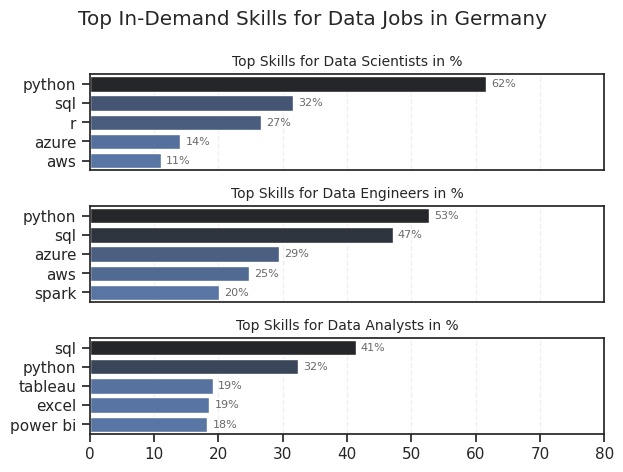
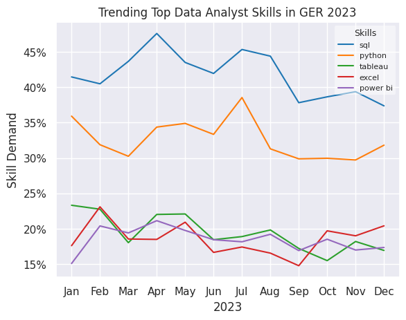

# Project Overview
This project provides an analysis of the data job market in Germany. It investigates the top-paying and in-demand skills for Data Analysts, Scientists and Engineers.  
I created this project within the scope of Luke Barousses 'Python for Data Analytics' course. The data provided in this course is used as a foundation for my analysis.

## Initial Questions
1. What are the most in-demand skills for the 3 most popular data roles?
2. How are in-demand skills for Data Analysts trending?
3. Relation between Salary and skills
4. What are the optimal skills to learn (based on demand and salary impact) ?

## Tools used
**Key Tools**
- Python & Jupyter Notebooks (within Visual Studio Code)
    - **Pandas** used to analyze data
    - **Matplotlib** used to visualize data
    - **Seaborn** used to adjust and improve visualizations 
  
## Data Prep & Cleanup
View notebook for details: [Notebook0: EDA_Intro](0_EDA_Intro.ipynb)  

## Analysis
Each jupyter notebook for this project investigates specific aspects of the data job market:
### 1. What are the most demanded skills for the top 3 data roles?
View notebook for details: [Notebook1: Skills_Count](1_Skills_Count.ipynb)  
**Data Visualization**  
  
Bar graph visualizing top in-demand 5 skills associated with each role  
**Insights:**
- Python & SQL are the most in-demand skills for all Data Scientists, -Analysts & Engineers, with Python leading in DS & DE roles, SQL leading in DA roles
- Data Engineers and Scientists require more specialized technical skills like AWS &Azure whereas Data Analyst skills focus on more general data management and analysis tools like tableau & excel    

### 2. How are in-demand skills trending for Data Analysts?
View notebook for details: [Notebook2: Skills_Trend](1_Skills_Trend.ipynb)  
**Data Visualization**  
  
Line chart visualizing top in-demand 5 skills for Data Analysts trending over the year 2023  
**Insights:**
- SQL and Python remain most demanded skills throughout the year, tho SQL is showing a downward trend
- There is a visible downward trend for almost all skills starting after July/August suggesting a seasonal low in hiring or shift in job descriptions. It shows a slight recovery by the end of the year
- all top skills are still relevant and dont show significant decline